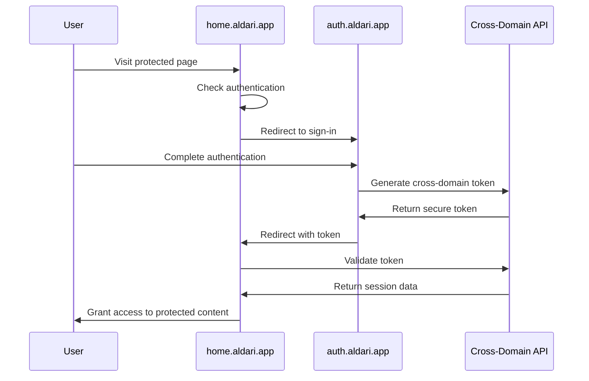

# ALDARI Cross-Domain SSO Architecture

## Overview

This document outlines the enterprise-grade cross-domain Single Sign-On (SSO) architecture implemented for ALDARI's property platform. The system enables seamless authentication between `auth.aldari.app` (authentication hub) and `home.aldari.app` (main application platform).

## Architecture Diagram

```
┌─────────────────┐         ┌─────────────────┐
│  auth.aldari.app │         │ home.aldari.app │
│                 │         │                 │
│  Sign-in/up     │◄────────┤  Property App   │
│  OAuth Flows    │         │  Dashboards     │
│  User Mgmt      │         │  Bookings       │
│  Verification   │         │  Inquiries      │
└─────────────────┘         └─────────────────┘
         │                           ▲
         │ Cross-Domain              │
         │ Token Exchange            │
         ▼                           │
┌─────────────────────────────────────────────────┐
│        Cross-Domain SSO System                  │
│                                                 │
│  • Secure Token Generation & Validation        │
│  • Cross-Domain Cookie Management              │
│  • Session Synchronization                     │
│  • Real-time Monitoring & Analytics            │
│  • Enterprise Security Controls                │
└─────────────────────────────────────────────────┘
```

## Key Components

### 1. Cross-Domain SSO Core (`lib/auth/cross-domain-sso.ts`)

**Purpose**: Manages secure token exchange and session synchronization between domains.

**Key Features**:
- Secure cross-domain token generation with 5-minute TTL
- Token validation with expiration checks
- Cross-domain cookie management with `.aldari.app` domain
- Automatic token cleanup and memory management
- CSRF protection and origin validation

**Configuration**:
```typescript
export const CROSS_DOMAIN_CONFIG: CrossDomainAuthConfig = {
  authDomain: 'auth.aldari.app',
  appDomain: 'home.aldari.app',
  cookieDomain: '.aldari.app',
  tokenTTL: 5 * 60 * 1000, // 5 minutes
  refreshTokenTTL: 24 * 60 * 60 * 1000, // 24 hours
};
```

### 2. Enhanced Middleware (`middleware.ts`)

**Purpose**: Handles cross-domain authentication checks and redirects at the Edge Runtime level.

**Key Capabilities**:
- Domain-specific route protection
- Cross-domain token processing
- Intelligent redirect handling
- Rate limiting and security headers
- Performance optimizations for Edge deployment

**Flow Logic**:
1. **Authentication Check**: Validates user session across domains
2. **Cross-Domain Token Handling**: Processes auth tokens from URL parameters
3. **Route Protection**: Redirects unauthenticated users appropriately
4. **Security Enforcement**: Applies headers and rate limiting

### 3. Global Authentication Provider (`components/auth/cross-domain-auth-provider.tsx`)

**Purpose**: Provides unified authentication state management across both domains.

**Features**:
- Real-time authentication state synchronization
- Automatic session restoration from cross-domain cookies
- Cross-domain redirect handling with token exchange
- Event-driven architecture for auth state changes
- Comprehensive error handling and user feedback

**Usage**:
```tsx
<CrossDomainAuthProvider>
  <YourApp />
</CrossDomainAuthProvider>
```

### 4. Secure API Endpoints

**Token Exchange API** (`/api/auth/cross-domain/token`):
- `POST`: Generate cross-domain tokens
- `GET`: Validate cross-domain tokens
- `DELETE`: Revoke all user tokens (logout)

**CSRF Protection API** (`/api/auth/cross-domain/csrf`):
- `GET`: Generate CSRF tokens for secure requests

### 5. Monitoring & Analytics (`lib/auth/cross-domain-monitoring.ts`)

**Purpose**: Enterprise-grade monitoring and error tracking for the authentication system.

**Capabilities**:
- Real-time authentication event logging
- Comprehensive metrics collection
- Automated alerting system
- Performance monitoring
- Security incident tracking
- Health status monitoring

**Monitored Events**:
- Sign-ins/Sign-ups
- Token generation/validation
- Cross-domain redirects
- Authentication errors
- Session management events

## Authentication Flow

### User Journey: auth.aldari.app → home.aldari.app

1. **Initial Access**: User visits `home.aldari.app`
2. **Authentication Check**: Middleware detects unauthenticated user
3. **Redirect to Auth**: User redirected to `auth.aldari.app/sign-in`
4. **Authentication**: User completes sign-in process
5. **Token Generation**: System generates secure cross-domain token
6. **Cross-Domain Redirect**: User redirected to `home.aldari.app` with token
7. **Token Validation**: Token validated and session established
8. **Session Synchronization**: Authentication state synchronized across domains

### Technical Implementation Flow



## Security Features

### 1. Token Security
- **Short-lived tokens**: 5-minute expiration for cross-domain tokens
- **Secure generation**: Cryptographically secure random token IDs
- **Single-use tokens**: Tokens automatically deleted after validation
- **Domain validation**: Tokens bound to specific domains

### 2. Cross-Site Protection
- **CSRF tokens**: Required for all token generation requests
- **Origin validation**: Strict origin checking for API requests
- **SameSite cookies**: Secure cookie configuration
- **HTTPS enforcement**: All cross-domain communication over HTTPS

### 3. Rate Limiting
- **Adaptive rate limiting**: Different limits for different operations
- **IP-based tracking**: Per-IP rate limiting with memory management
- **Automatic cleanup**: Expired rate limit entries automatically removed

### 4. Security Headers
- **Content Security Policy**: Comprehensive CSP for both domains
- **HSTS**: Strict Transport Security with preload
- **Frame Options**: Clickjacking protection
- **CORS Configuration**: Secure cross-origin resource sharing

## Deployment Configuration

### Domain-Specific Configurations

**auth.aldari.app** (`vercel-auth.json`):
- Handles all authentication flows
- Serves cross-domain token APIs
- Manages user registration and verification
- OAuth provider integrations

**home.aldari.app** (`vercel-app.json`):
- Main application platform
- Property listings and management
- User dashboards and profiles
- Cross-domain API proxying

### Environment Variables

```bash
# Cross-Domain Configuration
NEXT_PUBLIC_AUTH_DOMAIN=auth.aldari.app
NEXT_PUBLIC_APP_DOMAIN=home.aldari.app
NEXT_PUBLIC_APP_URL=https://auth.aldari.app  # Changes per domain

# Supabase Configuration
NEXT_PUBLIC_SUPABASE_URL=your-supabase-project-url
NEXT_PUBLIC_SUPABASE_ANON_KEY=your-supabase-anon-key
SUPABASE_SERVICE_ROLE_KEY=your-supabase-service-role-key

# OAuth Providers
GOOGLE_CLIENT_ID=your-google-client-id
GOOGLE_CLIENT_SECRET=your-google-client-secret

# Monitoring (Optional)
MONITORING_ENDPOINT=your-monitoring-service-url
MONITORING_API_KEY=your-monitoring-api-key
MONITORING_ADMIN_TOKEN=your-admin-token
```

## Performance Optimizations

### 1. Edge Runtime Compatibility
- Middleware optimized for Vercel Edge Runtime
- Fast authentication checks with 2.5-second timeout
- Efficient memory management for rate limiting

### 2. Caching Strategies
- Metrics caching with 5-minute TTL
- Session state persistence across page loads
- Smart cookie management for cross-domain access

### 3. Bundle Optimization
- Dynamic imports for authentication components
- Code splitting for domain-specific functionality
- Optimized package imports with experimental Next.js features

## Monitoring & Alerting

### Real-time Metrics
- Total sign-ins/sign-ups
- Cross-domain redirect success rate
- Token generation/validation rates
- Active user count
- Error rates and types

### Automated Alerts
- **High Error Rate**: Triggers when error rate > 5%
- **Failed Login Attempts**: Monitors for brute force attacks
- **Cross-Domain Failures**: Critical alerts for SSO system issues

### Health Monitoring
```bash
GET /api/auth/monitoring?type=health
```

### Metrics Export
```bash
GET /api/auth/monitoring?type=export&format=csv
```

## Development Setup

### 1. Environment Setup
```bash
# Install dependencies
npm install

# Copy environment configuration
cp .env.example .env.local

# Start development server
npm run dev
```

### 2. Testing Cross-Domain Flow
1. Configure local hosts for domain testing:
   ```
   127.0.0.1 auth.localhost
   127.0.0.1 home.localhost
   ```

2. Run development servers on different ports:
   ```bash
   # Auth domain
   NEXT_PUBLIC_APP_URL=http://auth.localhost:3000 npm run dev

   # App domain  
   NEXT_PUBLIC_APP_URL=http://home.localhost:3001 npm run dev
   ```

### 3. Monitoring Development
Access monitoring dashboard:
```bash
curl http://localhost:3000/api/auth/monitoring?type=health
```

## Production Deployment

### 1. Vercel Deployment
```bash
# Deploy auth domain
vercel --prod --local-config vercel-auth.json

# Deploy app domain
vercel --prod --local-config vercel-app.json
```

### 2. Domain Configuration
- Set up DNS records for both domains
- Configure SSL certificates
- Set up proper CORS policies
- Configure monitoring alerts

### 3. Monitoring Setup
- Configure external monitoring endpoints
- Set up alert webhooks
- Configure email notifications
- Set up log aggregation

## Troubleshooting

### Common Issues

**1. Cross-Domain Token Failures**
- Check domain configuration in environment variables
- Verify CORS settings in Vercel configuration
- Ensure proper cookie domain settings (`.aldari.app`)

**2. Authentication State Not Syncing**
- Check network connectivity between domains
- Verify token generation/validation API endpoints
- Check browser cookie settings and third-party restrictions

**3. Rate Limiting Issues**
- Review rate limiting configuration
- Check for memory leaks in rate limiter
- Verify IP extraction logic in middleware

### Debugging Tools

**Authentication Events**:
```bash
GET /api/auth/monitoring?type=events&limit=100
```

**Health Status**:
```bash
GET /api/auth/monitoring?type=health
```

**Metrics Dashboard**:
```bash
GET /api/auth/monitoring?type=metrics
```

## Security Considerations

### 1. Token Management
- Tokens are single-use and short-lived (5 minutes)
- Automatic cleanup prevents token accumulation
- Secure random generation prevents prediction

### 2. Cross-Domain Security
- Origin validation for all API requests
- CSRF protection for token generation
- Secure cookie configuration with proper domains

### 3. Monitoring & Incident Response
- Real-time error tracking and alerting
- Comprehensive audit logging
- Automated security incident detection

## Best Practices

### 1. Development
- Always test cross-domain flows in development
- Use proper error handling and user feedback
- Monitor authentication performance regularly

### 2. Production
- Set up comprehensive monitoring before launch
- Configure proper alert thresholds
- Regularly review security logs and metrics

### 3. Maintenance
- Regular token cleanup monitoring
- Performance optimization reviews
- Security audit and penetration testing

## Support & Maintenance

### Documentation
- API documentation available at `/api/auth/docs` (if implemented)
- Monitoring dashboard for real-time system status
- Error logs with detailed context for debugging

### Updates & Patches
- Regular dependency updates for security
- Performance monitoring and optimization
- Feature enhancements based on analytics

For technical support or questions about this system, refer to the development team or the comprehensive monitoring dashboard for real-time system insights.